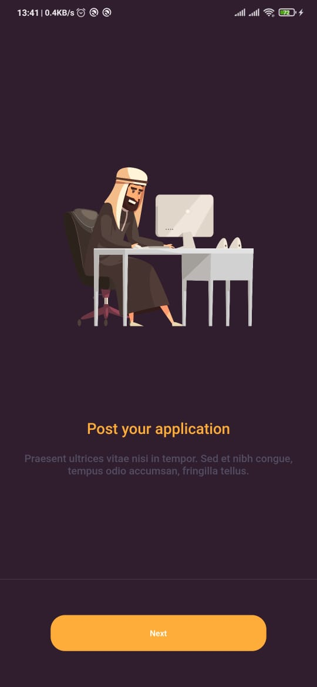
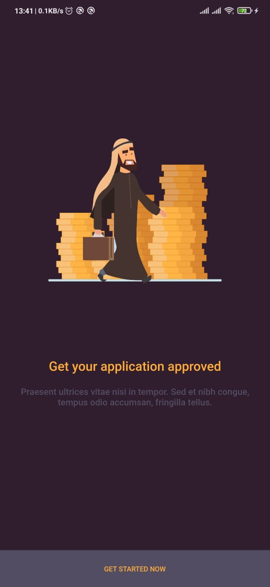
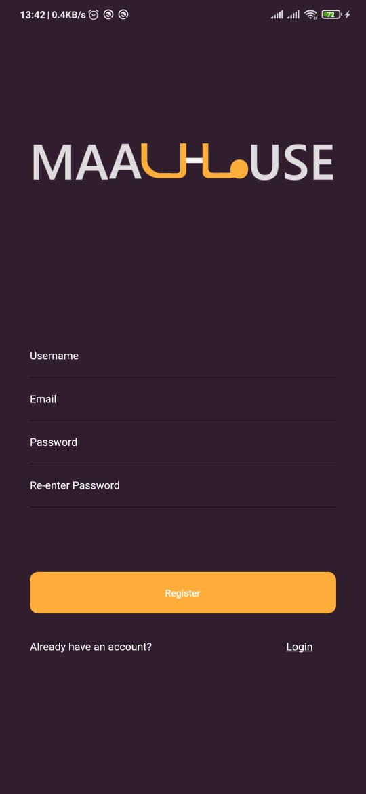
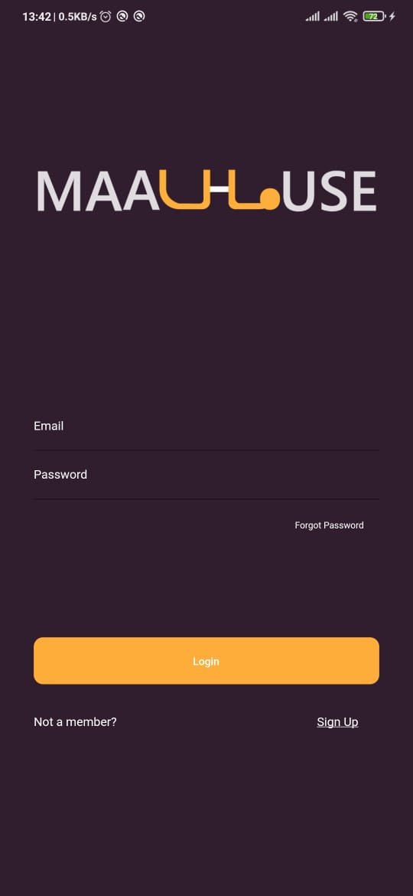
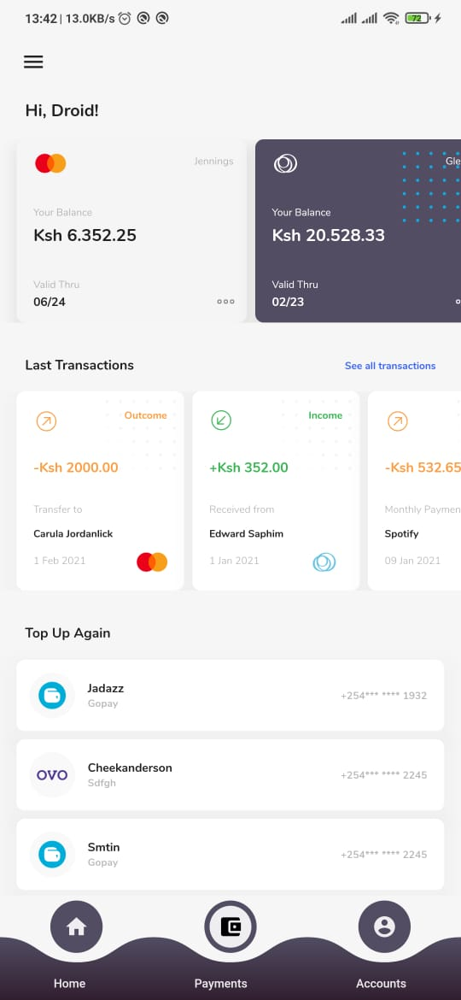

<!-- PROJECT LOGO -->
<br />
<p align="center">
  <a href="https://github.com/Droid021/maalhous">
    
  </a>

  <h3 align="center">Maalhous</h3>

  <p align="center">
  A sort of banking and loan application flutter app using firebase for auth and storage and designs stitched together from different sources online. 
  Arranged as feature by folder.

  Onboarding UI designs by Lewis. www.pixelewis.com 
    <br />
    <a href="#"><strong>Explore »</strong></a>
   </p>
</p>

### Installation

1. Clone the repo

```sh
git clone https://github.com/Droid021/maalhous.git
```

2. Change directory to the cloned repo directory

```sh
cd maalhous
```

3. Run the project

```JS
flutter run
```

<!-- USAGE EXAMPLES -->

## Sample Screenshots

<p align="center">
    <a href="#"><strong>Clone the repo and build the apk. »</strong></a>
   </p>

### Onboarding

   

### Login / Register

   

### Home Screen



<!-- LICENSE -->

## License

Distributed under the MIT License. See `LICENSE` for more information.

<!-- CONTACT -->

## Contact

Droid - [@darctrac3](https://twitter.com/darctrac3)
